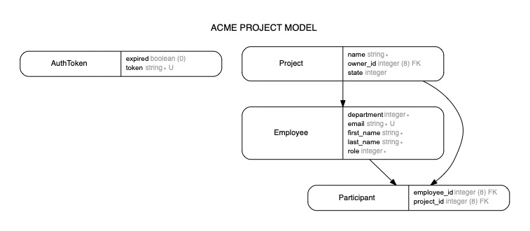

[Check Task Description](#task-description "Go to Task Description")

## Installation

### 1. Prerequisites

#### 1. In case of using Docker

1. [Install Docker](https://docs.docker.com/install/linux/docker-ce/ubuntu/)
2. [Install Docker Compose](https://docs.docker.com/compose/install/#install-compose)

#### 2. In case of running app through rails

1. Install MySQL
2. Install ruby 3.0.0

### 2. Installation

```
Clone the main repository at https://github.com/OYousryB/acme-project-management
```

```
git clone git@github.com:OYousryB/acme-project-management.git
$ cd acme-project-management
Use either one
$ make run
$ docker-compose up
```

Wait for all services to be up and running, don't close the terminal

### 3. test Connection

Open a new terminal or the browser and test out the connection

```
http://0.0.0.0:3000
curl -X GET   http://0.0.0.0:3000/ -H 'content-type: application/json'
```

### 4. Requests

**Using postman; Import `ACME.postman_collection.json` collection attached in the repo**

**You need to request an authentication first**

curl -X POST http://0.0.0.0:3000/api/v1/authenticate -H 'Content-Type: application/json'
then you can test out any API after adding the token in the headers

## Task Description

- Your task will be to provide the necessary APIs for the below:
  - Overview of all projects
  - Creating new projects
  - Updating projects
  - Assigning participants to a project.
- After an analysis of the requirements you should have the following insights:
  - A project must have a name, owner and state (planned, active, done, failed). The progress of active projects can be measured in percentage
  - Only managers can be the owner of a project
  - Participants can be assigned to a project
  - Participants must be part of the same department as the owner
  - Assignable participants or owner are employees, which are managed via an existing dedicated API (See https://employees-api.vercel.app/ for the API documentation)

## Suggested ERD


